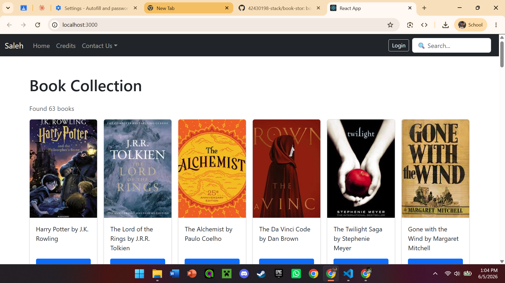
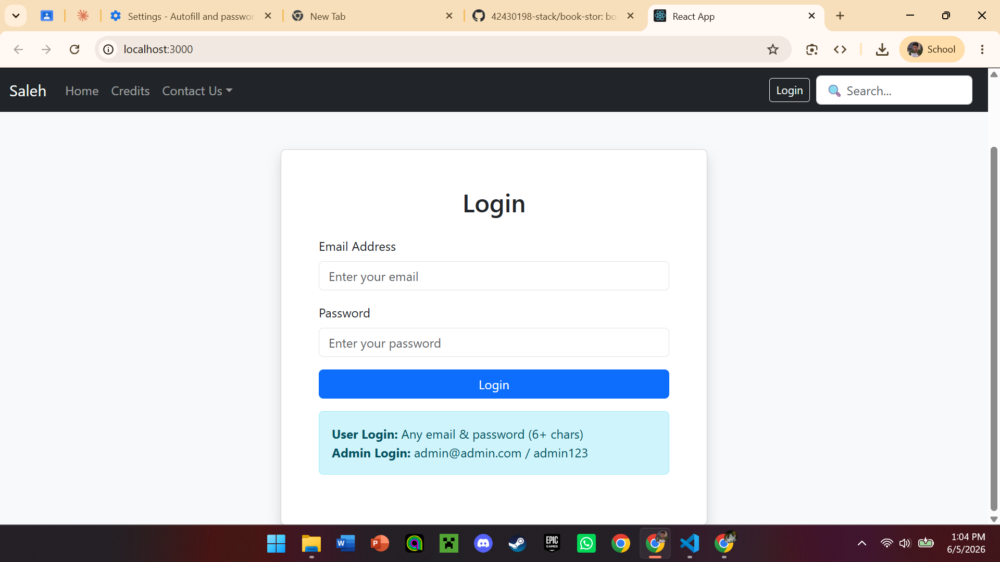
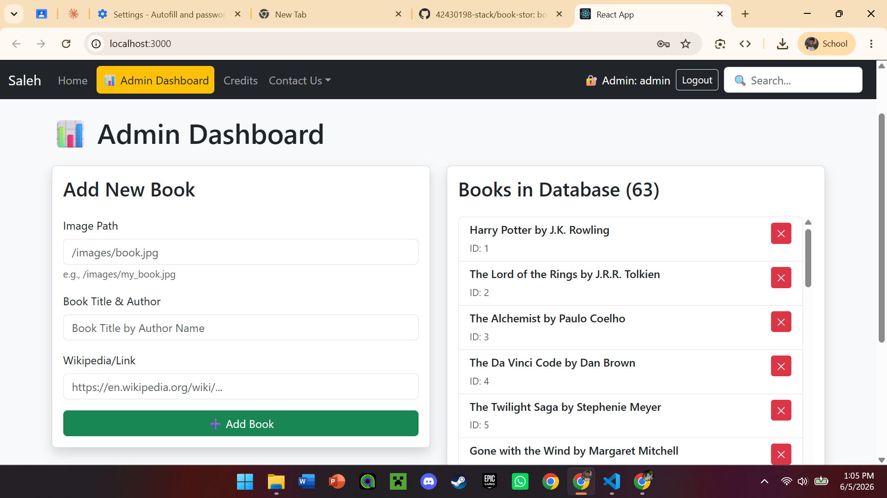

# Book Store 📚

A full-stack online bookstore built with React, Node.js.

---

## Project Description

This is an online bookstore system and a responsive React frontend.
It includes user authentication
using JWT

**Tech Stack:**
- Frontend: React + Bootstrap 5
- Auth: JWT (JSON Web Tokens)

---

## Setup Instructions

### Prerequisites
- Node.js installed
- Git

### 1. Clone the repository
git clone https://github.com/42430198-stack/book-stor.git
cd book-stor

### 2. Install frontend dependencies
cd ../frontend
npm install

### 3. Run the frontend
npm run dev

The app will be running at http://localhost:5173

---

## Screenshots

### Home Page

### Book Listing

### Login Page

---

## futcher updats

- allows users to browse books
- add them to a cart, and place orders
- a RESTful API backend
- Database: SQL Server (Book_Shop)
---

## Author
Saleh — CSCI390